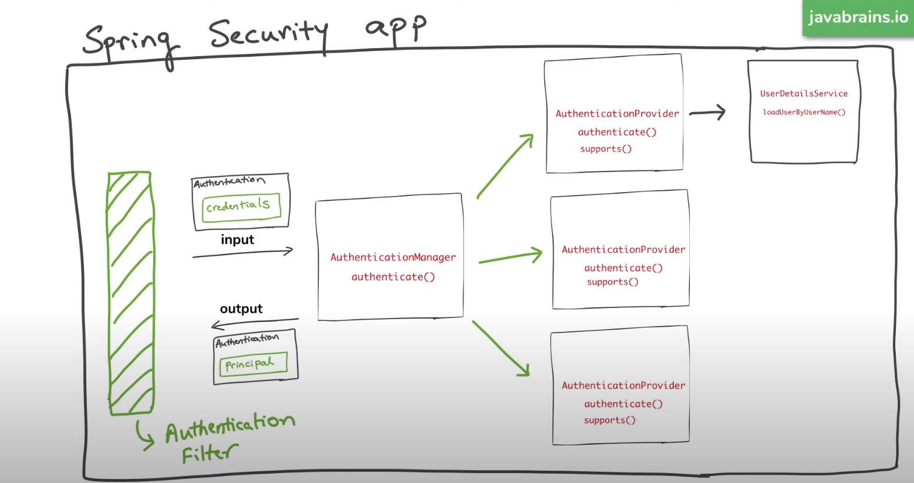
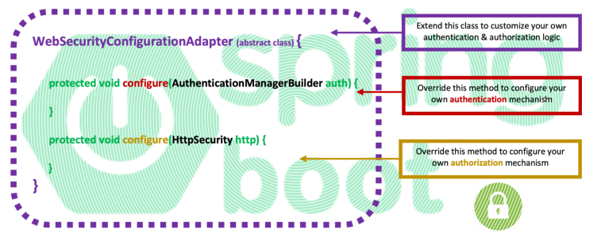
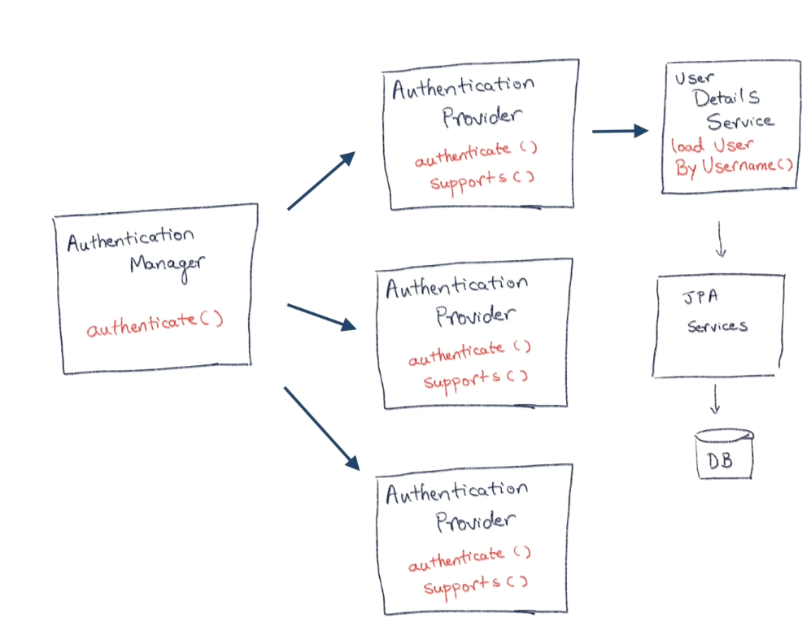
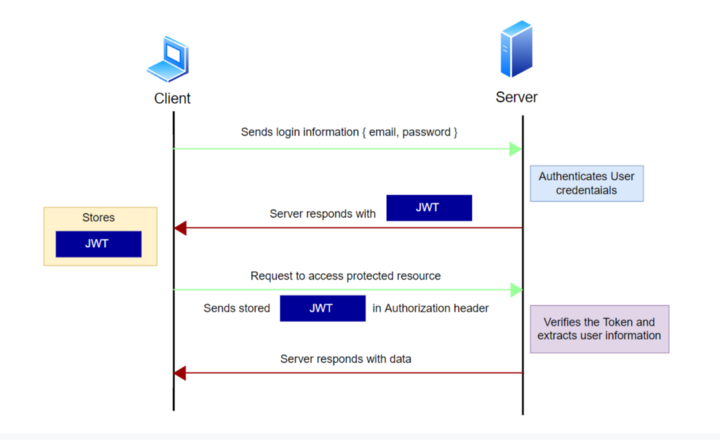
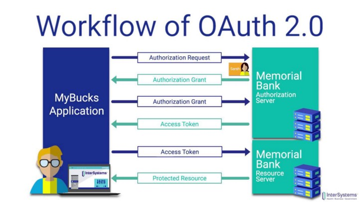

# Spring Security Tutorials

> ✅ **Part of the [Spring Boot Roadmap](https://github.com/arsy786/spring-boot-roadmap)** — a curated masterclass covering everything from Java basics to advanced Spring Boot practices and projects.

It is one of several interconnected repositories making up the broader [Spring Boot Roadmap](https://github.com/arsy786/spring-boot-roadmap), which provides a complete learning journey.

---

This project is a guide to learning Spring Security.

## Table of Contents
[1. Introduction to Spring Security](#1-introduction-to-spring-security)
<br>
&nbsp;&nbsp;&nbsp;&nbsp;&nbsp;[1.1 What is it?](#11-what-is-it)
<br>
&nbsp;&nbsp;&nbsp;&nbsp;&nbsp;[1.2 The 5 SS Concepts](#12-the-5-ss-concepts)
<br>
&nbsp;&nbsp;&nbsp;&nbsp;&nbsp;[1.3 Adding SS to SB app](#13-adding-ss-to-sb-app)
<br>
[2. Authentication](#2-authentication)
<br>
&nbsp;&nbsp;&nbsp;&nbsp;&nbsp;[2.1 What is it?](#21-what-is-it)
<br>
&nbsp;&nbsp;&nbsp;&nbsp;&nbsp;[2.2 Types of Authentication](#22-types-of-authentication)
<br>
&nbsp;&nbsp;&nbsp;&nbsp;&nbsp;[2.3 How to configure SS Authentication](#23-how-to-configure-ss-authentication)
<br>
&nbsp;&nbsp;&nbsp;&nbsp;&nbsp;[2.4 How SS Authentication works](#24-how-ss-authentication-works)
<br>
[3. Authorization](#3-authorization)
<br>
&nbsp;&nbsp;&nbsp;&nbsp;&nbsp;[3.1 What is it?](#31-what-is-it)
<br>
&nbsp;&nbsp;&nbsp;&nbsp;&nbsp;[3.2 How to configure SS Authorization](#32-how-to-configure-ss-authorization)
<br>
[4. Database Authentication](#4-database-authentication)
<br>
&nbsp;&nbsp;&nbsp;&nbsp;&nbsp;[4.1 JDBC](#41-jdbc)
<br>
&nbsp;&nbsp;&nbsp;&nbsp;&nbsp;[4.2 JPA](#42-jpa)
<br>
&nbsp;&nbsp;&nbsp;&nbsp;&nbsp;[4.3 LDAP Server](#43-ldap-server)
<br>
[5. JWT](#5-jwt)
<br>
&nbsp;&nbsp;&nbsp;&nbsp;&nbsp;[5.1 What is it?](#51-what-is-it)
<br>
&nbsp;&nbsp;&nbsp;&nbsp;&nbsp;[5.2 Method 1 - Filter-based JWT (No OAuth) (Secret)](#52-method-1---filter-based-jwt-no-oauth-secret)
<br>
[6. OAuth](#6-oauth)
<br>
&nbsp;&nbsp;&nbsp;&nbsp;&nbsp;[6.1 What is it?](#61-what-is-it)
<br>
&nbsp;&nbsp;&nbsp;&nbsp;&nbsp;[6.2 Method 1 - OAuth2 JWT (RSA Keys)](#62-method-2---oauth2-jwt-rsa-keys)

## 1. Introduction to Spring Security

### 1.1 What is it?
API security is a critical component in production ready applications, 
this is because businesses use APIs to connect services and to transfer data, 
therefore an unsecured API can lead to a myriad of problems such as data breaches. 

Spring Security is a powerful and highly customizable authentication and access-control framework. 
It is the de-facto standard for securing Spring-based applications.

Link to: [Spring Security (Spring)](https://spring.io/projects/spring-security)

### 1.2 The 5 SS Concepts

1. Authentication - Who is the user?
2. Authorization - Are they allowed to do this?
3. Principal - Currently logged-in user/account
4. (Granted) Authority - Permissions/access (fine-grained)
5. Role - Group of authorities (coarse-grained)

Link to: [Five Spring Security Concepts (YouTube/JavaBrains)](https://www.youtube.com/watch?v=I0poT4UxFxE&list=PLqq-6Pq4lTTYTEooakHchTGglSvkZAjnE&index=2)

### 1.3 Adding SS to SB app
Simply add the spring-boot-starter-security dependency to pom.xml. 
The default behaviour of SS once added to SB project:

1. Adds mandatory authentication for URLs
2. Adds login form
3. Handles login error
4. Creates a user (user) & sets a default password (generated in console)

Can configure the user and password in application.properties as follows:
``` properties
spring.security.user.name=foo
spring.security.user.password=pass 
```

NOTE: You should not configure the username and password in this location in production/real project. 
This is done for demonstration purposes only.

Link to: [Adding Spring Security to new Spring Boot project (YouTube/JavaBrains)](https://www.youtube.com/watch?v=PhG5p_yv0zs&list=PLqq-6Pq4lTTYTEooakHchTGglSvkZAjnE&index=3)

## 2. Authentication
NOTE: Since version 5.7.0-M2, Spring deprecates the use of WebSecurityConfigurerAdapter and 
suggests creating Security configurations without it.

### 2.1 What is it?
Authentication is how we verify the identity of who is trying to access a particular resource.
A common way to authenticate users is by requiring the user to enter a username and password. 
Once authentication is performed we know the identity and can perform authorization.

### 2.2 Types of Authentication


| Form Authentication | Basic Authentication |
| ----------- | ----------- |
| Form Authentication uses standard HTML form fields to pass the username and password values to the server via a POST request. | Basic Authentication uses an HTTP header in order to provide the username and password when making a request to a server. The header field itself looks like the following: **Authorization: Basic Base64-encoded(username:password)** |
| The server validates the credentials provided and creates a 'session' tied to a unique token stored in a cookie and passed between the client and the server on each HTTP request. If the cookie is invalid or the user is logged out, the server then usually redirects to a login page. | Basic Auth does NOT use cookies, hence there is no concept of a session or logging out a user, thus each request has to carry that header in order to be authenticated. |
| It is a programmatic method of authentication used to mitigate the fact that each request has to be authenticated in Basic Auth.| Base64 encodes binary data as values that can only be interpreted as text in textual media, and is free of any special characters and/or control characters, so that the data will be preserved across textual media as well.|
| In most cases, Form-based Auth is used to authenticate a web browser based client and an API. | In most cases, Basic Auth is used for authentication between API’s.|

Both Basic Auth and Form-based Auth are considered to be on the weak end of the security strength spectrum unless used with some external secure system such as TLS.

NOTE: It is STRONGLY advised to use HTTPS when choosing Basic Auth or Form-based Auth to secure your systems!

### 2.3 How to configure SS Authentication

- Spring Security by default secures all HTTP endpoints with “basic” (and/or "form") authentication.
- This implementation example will be of storing users in memory, and having SS authenticate and verify against them.

With WebSecurityConfigurerAdapter:
``` java
@Configuration
@EnableWebSecurity
public class SecurityConfig extends WebSecurityConfigurerAdapter {

    @Override
    protected void configure(AuthenticationManagerBuilder auth) throws Exception {
    
        auth.inMemoryAuthentication()
            .withUser("user")
            .password("pass")
            .roles("USER")
            .and()
            .withUser("admin")
            .password("pass")
            .roles("ADMIN")
    }

    @Bean
    public PasswordEncoder getPasswordEncoder() {
        return NoOpPasswordEncoder.getInstance();
    }
}
```
- @EnableWebSecurity annotation tells Spring Security that this class is a Web Security configuration. (Another way to do this, is via application/method level security annotations).
- WebSecurityConfigurerAdapter is extended here as it contains the methods that SS uses by default, and they can be overridden for our own custom implementation.
- Method chaining has been utilised here to make code/configuration more readable.
- .inMemoryAuthentication() only used for learning/example purposes!
- .roles required here for Role-based authorization (covered in next section).
- PasswordEncoder allows us to set a password encoder. It is required as you must NOT save plain text string passwords. Always deal with hashed passwords.

NOTE: For this example, the NoOpPasswordEncoder method does not do anything, you should NOT do this in production app and instead use an actual encryption method (such as BCrypt).

Without WebSecurityConfigurerAdapter:
``` java
@EnableWebSecurity
public class SecurityConfig {

	@Bean
	public InMemoryUserDetailsManager userDetailsManager() {
		UserDetails user = User.withDefaultPasswordEncoder()
				.username("user")
				.password("password")
				.roles("USER")
				.build();
				
		UserDetails admin = User.withDefaultPasswordEncoder()
				.username("admin")
				.password("password")
				.roles("ADMIN")
				.build();

		return new InMemoryUserDetailsManager(user, admin);
	}
}
```

Link to: [How to configure Spring Security Authentication (YouTube/JavaBrains)](https://www.youtube.com/watch?v=iyXne7dIn7U&list=PLqq-6Pq4lTTYTEooakHchTGglSvkZAjnE&index=4)

### 2.4 How SS Authentication works

Link to: [How Spring Security Authentication works (YouTube/JavaBrains)](https://www.youtube.com/watch?v=caCJAJC41Rk&list=PLqq-6Pq4lTTYTEooakHchTGglSvkZAjnE&index=7)






## 3. Authorization
NOTE: Since version 5.7.0-M2, Spring deprecates the use of WebSecurityConfigurerAdapter and suggests creating configurations without it.

### 3.1 What is it?
Authorization is a process by which a server determines if the client has permission to use a resource or access a file. It's an access control mechanism that determines whether or not a principal can conduct a task.

### 3.2 How to configure SS Authorization
- In SS, by default all API endpoints need authentication (can customize this). What we want however, is different endpoints having different access requirements (implementing authorization).
- In this example, given a Controller with different endpoints, we can enable/disable access to these API's depending on who the logged in user is.


HomeController:
``` java
@RestController
public class HomeController {

    @GetMapping("/")
    public String home() {
        return("Welcome");
    }

    @GetMapping("/user")
    public String user() {
        return("Welcome User");
    }
    
    @GetMapping("/admin")
    public String admin() {
        return("Welcome Admin");
    }

}
```

We want:

| API | Roles allowed to access it |
| ----------- | ----------- |
| **/** | All (unauthenticated) |
| **/user** | USER and ADMIN |
| **/admin** | ADMIN |

- To do this, we need to use HttpSecurity. This object lets us configure paths and their access restrictions.

With WebSecurityConfigurerAdapter:
``` java
@Configuration
@EnableWebSecurity
public class SecurityConfig extends WebSecurityConfigurerAdapter {

    @Override
    protected void configure(AuthenticationManagerBuilder auth) throws Exception {
    
        auth.inMemoryAuthentication()
            .withUser("user")
            .password("pass")
            .roles("USER")
            .and()
            .withUser("admin")
            .password("pass")
            .roles("ADMIN")
    }

    @Bean
    public PasswordEncoder getPasswordEncoder() {
        return NoOpPasswordEncoder.getInstance();
    }

    @Override
    protected void configure(HttpSecurity http) throws Exception {
    
        http.authorizeRequests()
            .antMatchers("/admin").hasRole("ADMIN")
            .antMatchers("/user").hasAnyRole("USER", "ADMIN")
            .antMatchers("/").permitAll()
            .and().formLogin();
    }

}
```
- If you have many endpoints with the same path and authorization requirement, can use /** to include all paths at the current level, as well as those nested below it.
- .hasRole() if endpoint only allows 1 specific role.
- .hasAnyRole() if endpoint allows multiple role access.
- .permitAll() if endpoint allows both anonymous and authenticated access.
- .and() to end chaining
- .formLogin() to set authentication method as form-based.

NOTE: the order of .antMatchers is important. It must go from most restrictive to least restrictive!
<br>
NOTE: SS creates a /logout endpoint by default to allow you to end sessions.

Without WebSecurityConfigurerAdapter:
``` java
@EnableWebSecurity
public class SecurityConfig {

	@Bean
	public SecurityFilterChain securityFilterChain(HttpSecurity http) throws Exception {
		http
		    .csrf(csrf -> csrf.disable())
		    .authorizeRequests(auth -> {
		        auth.antMatchers("/admin").hasRole("ADMIN");
		        auth.antMatchers("/user").hasAnyRole("USER", "ADMIN");
		        auth.antMatchers("/").permitAll();
		    })
		    .httpBasic(Customizer.withDefaults());

		return http.build();
	}

}
```

- .httpBasic(Customizer.withDefaults()) will enable Http Basic Authentication for your application with some "reasonable" defaults. It uses base64 encoding for a valid username/password combination.
- We are telling Spring to authenticate the request using the values passed by the Authorization request header. If the request is not authenticated you will get a returned status of 401  and a error message of Unauthorized.

Link to: [How to configure Spring Security Authorization (YouTube/JavaBrains)](https://www.youtube.com/watch?v=payxWrmF_0k&list=PLqq-6Pq4lTTYTEooakHchTGglSvkZAjnE&index=5)

## 4. Database Authentication
Spring Security provides support for username/password based authentication from a functioning Database layer connection.

*For code implementation example(s) check:*
[spring-security-jdbc](https://github.com/arsy786/spring-security-tutorials/tree/main/spring-security-jdbc)
or
[spring-security-jpa](https://github.com/arsy786/spring-security-tutorials/tree/main/spring-security-jpa)


### 4.1 JDBC

<ins>1. Create User tables and test data in schema.sql and data.sql respectively

- JDBC has a default schema in the format: id, username, password, role, enabled.
- If you are using the above default schema, you do NOT need to add a custom schema.sql, and can simply use .withDefaultSchema() method in Step 4 (Configure JDBC Authentication details).
- If you have a custom schema that differs from the default, to implement the changes, you must add schema.sql AND modify the SQL queries in Step 4.
- In this example, we will add a custom schema that purposefully follows the default schema format. And we will purposefully add the extra SQL queries. Despite this technically being redundant, this is being carried out so the code below will still be of use in cases where custom schemas are in effect (as adjustments can be easily applied).

schema.sql:
``` roomsql
CREATE TABLE users (
  username VARCHAR(50) NOT NULL,
  password VARCHAR(100) NOT NULL,
  enabled TINYINT NOT NULL DEFAULT 1,
  PRIMARY KEY (username)
);
  
CREATE TABLE authorities (
  username VARCHAR(50) NOT NULL,
  authority VARCHAR(50) NOT NULL,
  FOREIGN KEY (username) REFERENCES users(username)
);
```

data.sql:
``` roomsql
INSERT INTO users (username, password, enabled)
  values ('user',
    '$2a$10$8.UnVuG9HHgffUDAlk8qfOuVGkqRzgVymGe07xd00DMxs.AQubh4a',
    true);

INSERT INTO users (username, password, enabled)
  values ('admin',
    '$2a$10$8.UnVuG9HHgffUDAlk8qfOuVGkqRzgVymGe07xd00DMxs.AQubh4a',
    true);

INSERT INTO authorities (username, authority)
  values ('user', 'ROLE_USER');

INSERT INTO authorities (username, authority)
  values ('admin', 'ROLE_ADMIN');
```

<ins>2. Configure Data Source properties in application.properties

- Specify database connection information in the application.properties file.
- Update the URL, username and password according to your MySQL (or other) database.

application.properties:
``` properties
spring.datasource.url=jdbc:mysql://localhost:3306/testdb
spring.datasource.username=root
spring.datasource.password=password
```

<ins>3. Add dependencies to pom.xml

- To use Spring Security APIs for the project and to use JDBC with Spring Boot and MySQL:

pom.xml:
``` xml
<dependency>
    <groupId>org.springframework.boot</groupId>
    <artifactId>spring-boot-starter-security</artifactId>
</dependency>
<dependency>
    <groupId>org.springframework.boot</groupId>
    <artifactId>spring-boot-starter-jdbc</artifactId>
</dependency>
<dependency>
    <groupId>mysql</groupId>
    <artifactId>mysql-connector-java</artifactId>
    <scope>runtime</scope>
</dependency>
```

<ins>4. Configure JDBC Authentication details
- To use Spring Security with form-based authentication and JDBC:

SecurityConfig.java:
``` java
@Configuration
@EnableWebSecurity
public class WebSecurityConfig extends WebSecurityConfigurerAdapter {
 
    @Autowired
    private DataSource dataSource;
     
    @Autowired
    public void configure(AuthenticationManagerBuilder auth) throws Exception {
        auth.jdbcAuthentication().passwordEncoder(new BCryptPasswordEncoder())
            .dataSource(dataSource)
            .usersByUsernameQuery("select username, password, enabled "
                    + "from users "
                    + "where username = ?")
            .authoritiesByUsernameQuery("select username, authority "
                    + "from authorities "
                    + "where username = ?");
    }
 
    @Override
    protected void configure(HttpSecurity http) throws Exception {
        http.authorizeRequests()
            .anyRequest().authenticated()
            .and()
            .formLogin().permitAll()
            .and()
            .logout().permitAll();     
    }
}
```

- DataSource reads DB connection info from applications.properties file.
- For JDBC authentication, we need to specify a password encoder, data source and two SQL statements: the first one selects a user based on username, and the second one selects role of the user.
- And to configure form-based authentication, we override the configure(HttpSecurity) method. Here, we specify that all requests must be authenticated, meaning the users must login to use the application. The default login form provided by Spring Security is used.
- You can also configure HttpSecurity here to add authorization and make use of Roles/Authorities from DB, but for this example it was not implemented.

NOTE: If using default schema, .usersByUsernameQuery and .authoritiesByUsernameQuery is not required. Although default schema has been used in this example, these two methods have been added still, so you can easily adapt the code if the schema does become custom. 

Link to: [How to setup JDBC authentication with Spring Security from scratch (YouTube/JavaBrains)](https://www.youtube.com/watch?v=LKvrFltAgCQ&list=PLqq-6Pq4lTTYTEooakHchTGglSvkZAjnE&index=7)

### 4.2 JPA
- JDBC and LDAP come out of the box as Authentication providers for Spring Security. JPA however does not.
- Therefore, to implement JPA Authentication requires the implementation of UserDetailsService.



<ins>1. Dependencies

- For Spring Data JPA and Hibernate, Spring Security APIs and MySQL JDBC Driver:

``` xml
<dependency>
    <groupId>org.springframework.boot</groupId>
    <artifactId>spring-boot-starter-data-jpa</artifactId>
</dependency>
<dependency>
    <groupId>org.springframework.boot</groupId>
    <artifactId>spring-boot-starter-security</artifactId>
</dependency>
<dependency>
    <groupId>mysql</groupId>
    <artifactId>mysql-connector-java</artifactId>
    <scope>runtime</scope>
</dependency>
```

<ins>2. Configure Data Source properties

- Need to specify the database connection information in the application.properties files as follows:

``` properties
spring.datasource.url=jdbc:h2:mem:testdb
spring.datasource.driverClassName=org.h2.Driver
spring.datasource.username=sa
spring.datasource.password=
spring.datasource.platform=h2

spring.jpa.database-platform=org.hibernate.dialect.H2Dialect
spring.jpa.defer-datasource-initialization=true
spring.jpa.hibernate.ddl-auto=create-drop
```

<ins>3. User class

- To use Spring Data JPA, we need to add a model class that maps with the users table in the database.

``` java
@Entity
@Table(name = "user")
public class User {

    @Id
    @GeneratedValue(strategy = GenerationType.IDENTITY)
    private Long id;
 
    private String username;
    private String password;
    private String role;
    private boolean enabled; // not required
 
    // getters and setters are not shown for brevity

}
```

<ins>4. UserRepository class

- Extend JpaRepository and add findByUsername() method:

``` java
public interface UserRepository extends JpaRepository<User, Long> {
 
    Optional<User> findByUsername(String username);
}
```

<ins>5. Implement UserDetails

- This class wraps an instance of User class, which is injected via constructor. And we override methods defined by the UserDetails interface, to be used by Spring Security in the authentication process.

``` java
public class MyUserDetails implements UserDetails {
 
    private User user;
     
    public MyUserDetails(User user) {
        this.user = user;
    }
 
    @Override
    public Collection<? extends GrantedAuthority> getAuthorities() {
        return Arrays.stream(user
                .getRoles()
                .split(","))
                .map(SimpleGrantedAuthority::new)
                .toList();
    }
 
    @Override
    public String getPassword() {
        return user.getPassword();
    }
 
    @Override
    public String getUsername() {
        return user.getUsername();
    }
 
    @Override
    public boolean isAccountNonExpired() {
        return true;
    }
 
    @Override
    public boolean isAccountNonLocked() {
        return true;
    }
 
    @Override
    public boolean isCredentialsNonExpired() {
        return true;
    }
 
    @Override
    public boolean isEnabled() {
        return true;
    }
 
}
```

<ins>6. Implement UserDetailsService

- This class makes use of an implementation of UserRepository, which will be created and injected by Spring Data JPA. Here, we override the loadUserByUsername() method to authentication the users.

``` java
@Service
public class MyUserDetailsService implements UserDetailsService {

    private final UserRepository userRepository;

    public MyUserDetailsService(UserRepository userRepository) {
        this.userRepository = userRepository;
    }

    @Override
    public UserDetails loadUserByUsername(String username) throws UsernameNotFoundException {
        return userRepository
                .findByUsername(username)
                .map(SecurityUser::new)
                .orElseThrow(() -> new UsernameNotFoundException("Username not found: " + username));
    }
}
```

<ins>7. Configure authentication provider + HTTP Security

- Finally, we connect all the pieces together by coding a Spring Security configuration class WebSecurityConfig with the following code.

``` java
@Configuration
@EnableWebSecurity
public class WebSecurityConfig extends WebSecurityConfigurerAdapter {
  
    @Bean // or can autowire MyUserDetailsService
    public UserDetailsService userDetailsService() {
        return new MyUserDetailsService();
    } 
    
    @Bean
    public BCryptPasswordEncoder passwordEncoder() {
        return new BCryptPasswordEncoder();
    }
     
    @Bean
    public DaoAuthenticationProvider authenticationProvider() {
        DaoAuthenticationProvider authProvider = new DaoAuthenticationProvider();
        authProvider.setUserDetailsService(userDetailsService());
        authProvider.setPasswordEncoder(passwordEncoder());
         
        return authProvider;
    }
 
    @Override
    protected void configure(AuthenticationManagerBuilder auth) throws Exception {
        auth.authenticationProvider(authenticationProvider());
    }
 
    @Override
    protected void configure(HttpSecurity http) throws Exception {
        http.authorizeRequests()
            .anyRequest().authenticated()
            .and()
            .formLogin().permitAll()
            .and()
            .logout().permitAll();
    }
}
```

NOTE: To use Spring Security with Spring Data JPA and Hibernate, we need to supply a DaoAuthenticationProvider which requires UserDetailsService and PasswordEncoder.

Link to: [Spring Boot Security Authentication with JPA, Hibernate and MySQL (CodeJava)](https://www.codejava.net/frameworks/spring-boot/spring-boot-security-authentication-with-jpa-hibernate-and-mysql)
<br>
Link to: [Spring Security JPA Authentication in Spring Boot (YouTube/DanVega)](https://www.youtube.com/watch?v=awcCiqBO36E)
<br>

### 4.3 LDAP Server
N/A

## 5. JWT

NOTE: spring-security-jwt has been deprecated and refers developers to Spring Security OAuth2 (part of Spring Security 5.2.x).
Currently, there is no official documentation examples of using JWT **without** at least having an issuer service to distribute the signing key.




### 5.1 What is it?
JSON Web Token (JWT) is widely used for securing REST APIs. It is used for securely transmitting tokens along with HTTP requests, 
which facilitates stateless and secure communication between REST clients and API backend.
 
- JWT is a JSON based security token for API Authorization.
- JWTs can be signed using a secret (with HMAC algorithm) or a public/private key pair using RSA.
- Once a user is logged in, each subsequent request will require the JWT, allowing the user to access routes, services, and resources that are permitted with that token.


- JWT can contain unlimited amount of data (unlike cookies).
- JWT can be seen, but not modifiable once sent.
- JWT is just serialized, NOT encrypted.
- JWT is a mechanism for transferring data, NOT for securing it (only secure when used in tandem with encryption & transport security methodologies).
- JWT flow and structure shown in above images.

Link to: [What Is JWT and Why Should You Use JWT (YouTube/WebDevSimplified)](https://www.youtube.com/watch?v=7Q17ubqLfaM)
<br>

### 5.2 Method 1 - Filter-based JWT
*For code implementation example(s) check:*
[spring-security-jwt](https://github.com/arsy786/spring-security-tutorials/tree/main/spring-security-jwt)


This method adopts:

- Custom Filter
- Secret Key (Symmetric Key)
- Self-signed JWT's

This method is useful for small applications.

NOTE: No resource server used, custom implementation that requires the addition of a new custom security filter for JWT validation (via a JWT utility class) used instead.
<br>
NOTE: No authorization server used, self-signed JWT's used instead.


<ins>1. Dependencies

pom.xml:
``` xml
<dependency>
    <groupId>org.springframework.boot</groupId>
    <artifactId>spring-boot-starter-security</artifactId>
</dependency>
<dependency>
    <groupId>org.springframework.boot</groupId>
    <artifactId>spring-boot-starter-web</artifactId>
</dependency>
<dependency>
    <groupId>org.springframework.boot</groupId>
    <artifactId>spring-boot-starter-data-jpa</artifactId>
</dependency>
<dependency>
    <groupId>mysql</groupId>
    <artifactId>mysql-connector-java</artifactId>
    <scope>runtime</scope>
</dependency>
<dependency>
    <groupId>io.jsonwebtoken</groupId>
    <artifactId>jjwt</artifactId>
    <version>0.9.1</version>
</dependency>
<dependency>
    <groupId>org.springframework.boot</groupId>
    <artifactId>spring-boot-starter-validation</artifactId>
</dependency>
```

<ins>2. Data Source Properties

- Note that you must create a new database schema named productsdb, and update username and password according to your MySQL configuration.

application.properties:
``` properties
spring.datasource.url=jdbc:mysql://localhost:3306/productsdb
spring.datasource.username=root
spring.datasource.password=password

spring.jpa.hibernate.ddl-auto=update
spring.jpa.properties.hibernate.format_sql=true
spring.jpa.show-sql=true
spring.jpa.properties.hibernate.dialect=org.hibernate.dialect.MySQL8Dialect

app.jwt.secret=abcdefghijklmnOPQRSTUVWXYZ
```

- Adding some starter data

data.sq:
``` properties
INSERT INTO products(name, price) values ('iPhone 13 Pro', 1000)
INSERT INTO products(name, price) values ('Microsoft Surface', 899)

INSERT INTO roles(name) values ('ROLE_USER')
INSERT INTO roles(name) values ('ROLE_ADMIN')

INSERT INTO users(email, password) values ('arsalaan@gmail.com', '$2a$10$H2ER6pWkuHcQyGFUSw/BZ.nONiqgvEQQjMXQpg.2E1AmZ6b4SuvSm')
-- password is password
```

<ins>3. Code REST API's with Spring Data JPA

- Code typical REST API. In this example, we are creating a Products API.

Product.java:
``` java
@Entity
@Table(name = "products")
public class Product {
    
    @Id 
    @GeneratedValue(strategy = GenerationType.IDENTITY)
    private Integer id;
     
    @Column(nullable = false, length = 128)
    @NotNull @Length(min = 5, max = 128)
    private String name;
     
    private float price;
 
    // getters and setters are not shown for brevity
}
```

ProductRepository.java:
``` java
@Repository
public interface ProductRepository extends JpaRepository<Product, Integer> {

}
```

ProductController.java:
``` java
@RestController
@RequestMapping("/products")
public class ProductController {
 
    @Autowired 
    private ProductRepository productRepository;
     
    @PostMapping
    public ResponseEntity<Product> create(@RequestBody @Valid Product product) {
        Product savedProduct = productRepository.save(product);
        URI productURI = URI.create("/products/" + savedProduct.getId());
        return ResponseEntity.created(productURI).body(savedProduct);
    }
     
    @GetMapping
    public List<Product> list() {
        return productRepository.findAll();
    }
}
```

NOTE: We would typically put business logic in Service layer, but for demonstration purposes, we have exposed the Repository directly in the Controller layer.
<br>
NOTE: These endpoints are unsecured for early testing purposes. The SecurityConfig class at this stage of development will permit all requests without authentication, disable csrf and have a stateless session (as no session management needed). 

- Example of SecurityConfig at this stage of development:

SecurityConfig.java:
``` java
@EnableWebSecurity
public class SecurityConfig extends WebSecurityConfigurerAdapter {
 
    @Override
    protected void configure(HttpSecurity http) throws Exception {
        http.csrf().disable();
        http.authorizeRequests().anyRequest().permitAll();
        http.sessionManagement().sessionCreationPolicy(SessionCreationPolicy.STATELESS);
    }
 
}
```

**Now the REST API has been developed, it is time to implement the Security!**

<ins>4. User & Role Entity, User & Role Repository and AddUserToRole DTO

- Firstly, create the User entity class that represents a user of the application. 
This class is mapped to the users table in database and has a @ManyToMany mapping with the Roles field.

User.java:
``` java
@Data
@Entity
@Table(name = "users") // user is a reserved keyword therefore must rename to users
public class User {

    @Id
    @GeneratedValue(strategy = GenerationType.IDENTITY)
    private Integer id;

    @Column(nullable = false, unique = true)
    @Email
    private String email;

    @Column(nullable = false)
    private String password;

    @ManyToMany(fetch = FetchType.EAGER, cascade = CascadeType.ALL)
    @JoinTable(name = "user_roles",
            joinColumns = @JoinColumn(name = "user_id", referencedColumnName = "id"),
            inverseJoinColumns = @JoinColumn(name = "role_id", referencedColumnName = "id"))
    private Set<Role> roles;

}
```

Role.java:
``` java
@Getter
@Setter
@Entity
@Table(name = "roles")
public class Role {

    @Id
    @GeneratedValue(strategy = GenerationType.IDENTITY)
    private long id;

    @Column(length = 60)
    private String name;

}
```

- findByEmail method added to query DB for authentication.

UserRepository.java:
``` java
@Repository
public interface UserRepository extends JpaRepository<User, Integer> {
    Optional<User> findByEmail(String email);
}
```

- findByName method added to query DB for assigning a Role to a User.

RoleRepository.java:
``` java
@Repository
public interface RoleRepository extends JpaRepository<Role, Long> {
    Optional<Role> findByName(String name);
}
```

- DTO for adding a Role to a User HTTP Request.

UserRoleRequest.java:
``` java
@Data
public class UserRoleRequest {
    private String email;
    private String roleName;
}
```

<ins>5. Extend UserDetailsService

- We override the loadUserByUsername() method to authentication the users.
- Our implementation of UserDetailsService is where the authority (role) mapping takes place. Once the user has authenticated, our getAuthorities() method populates and returns a UserDetails object.

JwtUserDetailsService.java:
``` java
@Service
public class JwtUserDetailsService implements UserDetailsService {

    @Autowired
    private UserRepository userRepository;

    @Override // loadUserByEmail* in this case
    public UserDetails loadUserByUsername(String email) throws UsernameNotFoundException {

        User user = userRepository.findByEmail(email)
                .orElseThrow(() -> new UsernameNotFoundException("User not found with email: " + email));

        return new org.springframework.security.core.userdetails.User(user.getEmail(), user.getPassword(), mapRolesToAuthorities(user.getRoles()));
    }

    private Collection< ? extends GrantedAuthority> mapRolesToAuthorities(Set<Role> roles) {
        return roles.stream()
                .map(role -> new SimpleGrantedAuthority(role.getName())).collect(Collectors.toList());
    }

}
```

<ins>6. JWT Token Utility

- Utility class that uses the jjwt library to generate an access token based on a given User object. This class also contains other methods related to JWT.

``` java
@Component
public class JwtTokenUtil {

    @Value("${app.jwt.secret}")
    private String SECRET_KEY;
    private static final long EXPIRE_DURATION = 1 * 60 * 60 * 1000; // 1 hour
    private static final Logger LOGGER = LoggerFactory.getLogger(JwtTokenUtil.class); // can use @Slf4j instead

    // generate token
    public String generateToken(Authentication authentication) {

        String username = authentication.getName();
        Date currentDate = new Date();
        Date expireDate = new Date(currentDate.getTime() + EXPIRE_DURATION);

        String token = Jwts.builder()
                .setSubject(username)
                .setIssuer("DevArsalaan")
                .setIssuedAt(currentDate)
                .setExpiration(expireDate)
                .signWith(SignatureAlgorithm.HS512, SECRET_KEY)
                .compact();
        return token;
    }

    // validate JWT token
    public boolean validateToken(String token) {
        try {
            Jwts.parser().setSigningKey(SECRET_KEY).parseClaimsJws(token);
            return true;
        } catch (ExpiredJwtException ex) {
            LOGGER.error("Expired JWT token", ex.getMessage());
        } catch (IllegalArgumentException ex) {
            LOGGER.error("Token is null, empty or only whitespace", ex.getMessage());
        } catch (MalformedJwtException ex) {
            LOGGER.error("Invalid JWT token", ex);
        } catch (UnsupportedJwtException ex) {
            LOGGER.error("Unsupported JWT token", ex);
        } catch (SignatureException ex) {
            LOGGER.error("Invalid JWT signature");
        }
        return false;
    }

    // get username/email from the token
    public String getUsernameFromToken(String token) {
        Claims claims = Jwts.parser()
                .setSigningKey(SECRET_KEY)
                .parseClaimsJws(token)
                .getBody();
        return claims.getSubject();
    }
    
}
```

- generateAccessToken() method creates a JSON Web Token with the following details: 
  - Subject is a combination of the user’s ID and email, separated by a comma. 
  - Issuer name is DevArsalaan. 
  - The token is issued at the current date and time. 
  - The token should expire after 24 hours. 
  - The token is signed using a secret key, which you can specify in the application.properties file or from system environment variable. 
  - And the signature algorithm is HMAC using SHA-512.
- validateAccessToken(): used to verify a given JWT. It returns true if the JWT is verified, or false otherwise.
- getSubject(): gets the value of the subject field of a given token. The subject contains User ID and email, which will be used to recreate a User object.

<ins>7. JWT Token (Request) Filter

- To access the secure REST APIs, the client must include an access token in the Authorization header of the request. So we need to insert our own filter in the middle of Spring Security filters chain, before the UsernameAndPasswordAuthenticationFilter, in order to check the Authorization header of each request.

JwtRequestFilter.java:
``` java
@Component
public class JwtRequestFilter extends OncePerRequestFilter {

    @Autowired
    private JwtTokenUtil jwtTokenUtil;

    @Autowired
    private JwtUserDetailsService jwtUserDetailsService;

    @Override
    protected void doFilterInternal(HttpServletRequest request, HttpServletResponse response, FilterChain filterChain) throws ServletException, IOException {

        // get JWT (token) from http request
        String token = getJWTfromRequest(request);

        // validate token
        if(StringUtils.hasText(token) && jwtTokenUtil.validateToken(token)){

            // get username from token
            String email = jwtTokenUtil.getUsernameFromToken(token);

            // load user associated with token
            UserDetails userDetails = jwtUserDetailsService.loadUserByUsername(email);
            UsernamePasswordAuthenticationToken authenticationToken = new UsernamePasswordAuthenticationToken(userDetails, null, userDetails.getAuthorities());
            authenticationToken.setDetails(new WebAuthenticationDetailsSource().buildDetails(request));

            // set spring security
            SecurityContextHolder.getContext().setAuthentication(authenticationToken);
        }

        filterChain.doFilter(request, response);
    }

    // Bearer <accessToken>
    private String getJWTfromRequest(HttpServletRequest request){

        String bearerToken = request.getHeader("Authorization");

        if(StringUtils.hasText(bearerToken) && bearerToken.startsWith("Bearer ")){
            return bearerToken.substring(7, bearerToken.length());
        }

        return null;
    }

}
```

- Class extends the OncePerRequestFilter class to guarantee a single execution per request.
- When it comes into play, the doFilterInternal() method gets invoked.

Here’s how it works:
- If the Authorization header of the request doesn’t contain a Bearer token, it continues the filter chain without updating authentication context.
- Else, if the token is not verified, continue the filter chain without updating authentication context.
- If the token is verified, update the authentication context with the user details ID and email. In other words, it tells Spring that the user is authenticated, and continue the downstream filters.

<ins>8. Authentication Classes (Jwt Request & Response DTO's and Auth Controller)

- Code a REST API end point that authenticates user (/login endpoint) and returns a JWT access token if the credentials are valid.
- AuthController also contains API's to: get Users, save a User, save a Role, add a Role to a User and register a User. 

AuthRequest.java:
``` java
@Data
public class JwtRequest {
    private String email;
    private String password;
}
```

AuthResponse.java:
``` java
@Getter
@Setter
@AllArgsConstructor
public class JwtResponse {
    private String email;
    private String accessToken;
}
```

AuthController.java:
``` java
@RestController
@RequestMapping("/auth")
public class AuthController {

    @Autowired
    private AuthenticationManager authenticationManager;

    @Autowired
    private UserRepository userRepository;

    @Autowired
    private RoleRepository roleRepository;

    @Autowired
    private PasswordEncoder passwordEncoder;

    @Autowired
    private JwtTokenUtil jwtTokenUtil;

    @GetMapping("/users")
    public ResponseEntity<List<User>>getUsers() {
        return ResponseEntity.ok().body(userRepository.findAll());
    }

    @PostMapping("/user/save")
    public ResponseEntity<User>saveUser(@RequestBody User user) {
        URI uri = URI.create(ServletUriComponentsBuilder.fromCurrentContextPath().path("/auth/user/save").toUriString());
        return ResponseEntity.created(uri).body(userRepository.save(user));
    }

    @PostMapping("/role/save")
    public ResponseEntity<Role>saveRole(@RequestBody Role role) {
        URI uri = URI.create(ServletUriComponentsBuilder.fromCurrentContextPath().path("/api/role/save").toUriString());
        return ResponseEntity.created(uri).body(roleRepository.save(role));
    }

    @PostMapping("/role/addtouser")
    public ResponseEntity<?>addRoleToUser(@RequestBody UserRoleRequest addRoleToUserRequest) {
        User user = userRepository.findByEmail(addRoleToUserRequest.getEmail()).get();
        Role role = roleRepository.findByName(addRoleToUserRequest.getRoleName()).get();
        user.getRoles().add(role);
        userRepository.save(user);
        return ResponseEntity.ok().build();
    }

    @PostMapping("/login")
    public ResponseEntity<?> authenticateUser(@RequestBody JwtRequest jwtRequest){

        Authentication authentication = authenticationManager.authenticate(new UsernamePasswordAuthenticationToken(jwtRequest.getEmail(), jwtRequest.getPassword()));
        SecurityContextHolder.getContext().setAuthentication(authentication);

        // get token form jwtTokenUtil
        String accessToken = jwtTokenUtil.generateToken(authentication);
        JwtResponse jwtResponse = new JwtResponse(jwtRequest.getEmail(), accessToken);

        return ResponseEntity.ok().body(jwtResponse);
    }

    @PostMapping("/register") // should use a registerDto instead of handling User entity in Controller layer
    public ResponseEntity<?> registerUser(@RequestBody User registerUser){

        // add check for email exists in DB
        if(userRepository.findByEmail(registerUser.getEmail()).isPresent()){
            return new ResponseEntity<>("Email is already taken!", HttpStatus.BAD_REQUEST);
        }

        // create and save new user object
        User saveUser = new User();
        saveUser.setEmail(registerUser.getEmail());
        saveUser.setPassword(passwordEncoder.encode(registerUser.getPassword()));

        // every new registered user has ROLE_USER by default
        Role roles = roleRepository.findByName("ROLE_USER").get();
        saveUser.setRoles(Collections.singleton(roles));

        userRepository.save(saveUser);

        return new ResponseEntity<>("User registered successfully", HttpStatus.OK);
    }


}
```

- Here, the URI is /auth/login and we use an authentication manager to authenticate the user. That’s why we need to expose a bean of type AuthenticationManager in the security config class.
- In case the credential is invalid, a BradCredentialsException is thrown and the API returns HTTP status 401 (Unauthorized). If valid, it uses the JwtTokenUtil class to generate a new access token, which is then attached to the response object of type AuthResponse (JwtResponse).


<ins>9. Security Configuration

- Here is where we finally configure all the Security setings.

With WebSecurityConfigurerAdapter:
``` java
@Configuration
@EnableWebSecurity
@EnableGlobalMethodSecurity(prePostEnabled = true)
public class SecurityConfig extends WebSecurityConfigurerAdapter {

    @Autowired
    private JwtRequestFilter jwtRequestFilter;

    @Autowired
    private JwtUserDetailsService jwtUserDetailsService;

    @Bean
    public PasswordEncoder passwordEncoder() {
        return new BCryptPasswordEncoder();
    }

    @Override
    protected void configure(HttpSecurity http) throws Exception {
        http
                .csrf().disable()
                .exceptionHandling()
                .authenticationEntryPoint((request, response, ex) -> response.sendError(HttpServletResponse.SC_UNAUTHORIZED, ex.getMessage())) // could store this in JwtAuthenticationEntryPoint implements AuthenticationEntryPoint class instead
                .and()
                .sessionManagement()
                .sessionCreationPolicy(SessionCreationPolicy.STATELESS)
                .and()
                .authorizeRequests()
//              .antMatchers(GET, "/products").hasAnyRole("USER", "ADMIN") added method level auth
//              .antMatchers(POST, "/products").hasRole("ADMIN")
                .antMatchers("/auth/**").permitAll()
                .antMatchers("/h2-console/**").permitAll() // enabling h2-console access
                .anyRequest().authenticated()
                .and().headers().frameOptions().disable(); // enabling h2-console access
        http.addFilterBefore(jwtRequestFilter, UsernamePasswordAuthenticationFilter.class);


    }

    @Override
    protected void configure(AuthenticationManagerBuilder auth) throws Exception {
        auth.userDetailsService(jwtUserDetailsService)
                .passwordEncoder(passwordEncoder());
    }

    @Override
    @Bean
    public AuthenticationManager authenticationManagerBean() throws Exception {
        return super.authenticationManagerBean();
    }

}
```

Without WebSecurityConfigurerAdapter:
``` java
@Configuration
public class ApplicationSecurity {
     
    @Autowired private UserRepository userRepo;
    @Autowired private JwtTokenFilter jwtTokenFilter;
     
    @Bean
    public UserDetailsService userDetailsService() {
        return new UserDetailsService() {
             
            @Override
            public UserDetails loadUserByUsername(String username) throws UsernameNotFoundException {
                return userRepo.findByEmail(username)
                        .orElseThrow(
                                () -> new UsernameNotFoundException("User " + username + " not found"));
            }
        };
    }
     
    @Bean
    public PasswordEncoder passwordEncoder() {
        return new BCryptPasswordEncoder();
    }
     
    @Bean
    public AuthenticationManager authenticationManager(
            AuthenticationConfiguration authConfig) throws Exception {
        return authConfig.getAuthenticationManager();
    }
     
    @Bean
    public SecurityFilterChain configure(HttpSecurity http) throws Exception {
        http.csrf().disable();
        http.sessionManagement().sessionCreationPolicy(SessionCreationPolicy.STATELESS);
         
        http.authorizeRequests()
                .antMatchers("/auth/login", "/docs/**", "/users").permitAll()
                .anyRequest().authenticated();
         
            http.exceptionHandling()
                    .authenticationEntryPoint(
                        (request, response, ex) -> {
                            response.sendError(
                                HttpServletResponse.SC_UNAUTHORIZED,
                                ex.getMessage()
                            );
                        }
                );
         
        http.addFilterBefore(jwtTokenFilter, UsernamePasswordAuthenticationFilter.class);
         
        return http.build();
    }  
}
```

Source and more info:
<br>
Link to: [Spring Security JWT Authentication Tutorial (CodeJava)](https://www.codejava.net/frameworks/spring-boot/spring-security-jwt-authentication-tutorial)
<br>
Link to: [Spring Boot and Spring Security with JWT including Access and Refresh Tokens (YouTube/AmigosCode)](https://www.youtube.com/watch?v=VVn9OG9nfH0&t=399s)

## 6. OAuth


### 6.1 What is it?
- OAuth is an Open standard for **authorization** (NOT an API or a service).
- Can use JWT as a token for OAuth.
- OAuth uses both server-side & client-side storage.
- It has a server that keeps track of tokens.
- OAuth answers the dilemma of: How can I let an application access (some of) my data… without giving it my password?
- Instead of, “sign-in with email and password” we get: "sign-in with Facebook" (or Google, LinkedIn, Twitter etc.)
- The client software can be authorized to access the resources on behalf of end user using an access token.

<ins>Wha is an Authorization Server?

At its core, an authorization server is simply an engine for minting OpenID Connect or OAuth 2.0 tokens. 
An authorization server is also used to apply access policies. 
Each authorization server has a unique issuer URI and its own signing key for tokens to keep a proper boundary between security domains.

A few examples for such authorization servers/services are: Asgardeo, Keycloak, OneLogin, Auth0 and Okta.

<ins>What is a Resource Server?

In the context of OAuth 2.0, a resource server is an application that protects resources via OAuth tokens.
Basically, it is any application (usually an API) with functions that requires OAuth authenticated access.
These tokens are issued by an authorization server, typically to a client application. The job of the resource server is to validate the token before serving a resource to the client.

A token's validity is determined by several things:
- Did this token come from the configured authorization server?
- Is it unexpired?
- Is this resource server its intended audience?
- Does the token have the required authority to access the requested resource?

Link to: [What is OAuth really all about - OAuth tutorial (YouTube/JavaBrains)](https://www.youtube.com/watch?v=t4-416mg6iU)
<br>

### 6.2 Method 2 - OAuth2 JWT
*For code implementation example(s) check:*
[jwt-oauth2-demo](https://github.com/arsy786/spring-security-tutorials/tree/main/jwt-oauth2-demo)

This method adopts:

- OAuth2.0 Resource Server 
- RSA Public/Private Key Pair (Asymmetric Keys)
- Self-signed JWT's

This method is useful for increasing the security of JWT's. It can also be considered easier to implement, as this method does not require
the introduction of a custom filter.

NOTE: No authorization server used, self-signed JWT's used instead.

<ins>What is so different about this Method?

The previous method involved writing a custom filter chain and pulling in a 3rd party library for encoding and decoding JWTs.
However, we can make use of Spring Security's built-in JWT validation support for using OAuth2 Resource Server.
Therefore, instead of introducing a custom filter, we can make use of the OAuth2 resource server to implement JWT authentication.

Furthermore, the type of key used for the JWT signature in this method differs.
A JWT can be encrypted using either a symmetric key (shared secret) or asymmetric keys (the private key of a private-public pair).

In symmetric encryption, the message is encrypted and decrypted using the same key. In asymmetric encryption, the message is encrypted using the public key, and the private key is used to decrypt the message.

There are pros/cons to each, but it is generally recommended that you use Asymmetric keys.

<ins>What is similar between both Methods?

They both adopt self-signed JWTs which eliminates the need to introduce an authorization server.
Instead of using an authorization server to issue JWTs, I decided to write a ‘/login’ endpoint which issues a JWT upon successful login. 

<ins>Authorization Server vs. self-signed JWT's

While using self-signed JWT's works for this example, your application requirements may differ, so... 
when is it no longer acceptable to use self-signed JWTs?

When you reach the point where the trade-offs for self-signed JWTs are no longer acceptable. 

For example, you may want to use a distinct authorization server if you want to:
- introduce refresh tokens
- have more than one service - authorization server should be hosted and run as a separate service.
- harden security - isolating something as critical as authentication provides value because the attack surface is reduced.

It is more popular in the case of microservices architecture where the single auth server can be used for multiple resource servers.

An example of this exact scenario where Keycloak is used as the authorization server for a microservices architecture is available at:

Link to: [Spring Boot Microservices Project](https://github.com/arsy786/spring-boot-microservices-new)
<br>
Link to: [Spring Boot Microservices Project - 5. Security](https://github.com/arsy786/spring-boot-microservices-new#5-security)

<ins>Supporting Material

Link to: [Spring Boot Spring Security JWT (YouTube/DanVega)](https://www.youtube.com/watch?v=UaB-0e76LdQ)
<br>
Link to: [JWT Authentication With Spring Boot’s Inbuilt OAuth2 Resource Server (Medium/ImeshaSudasingha)](https://12ft.io/proxy?ref=&q=https://medium.com/swlh/stateless-jwt-authentication-with-spring-boot-a-better-approach-1f5dbae6c30f)
<br>
Link to: [JWT Authentication with OAuth2 Resource Server and an external Authorization Server (Medium/ImeshaSudasingha)](https://12ft.io/proxy?q=https%3A%2F%2Fmedium.com%2Fgeekculture%2Fjwt-authentication-with-oauth2-resource-server-and-an-external-authorization-server-2b8fd1524fc8)


<ins>1. Dependencies

- Spring Web, OAuth2 Resource Server, Spring Config Processor, Spring Data JPA, H2
- Spring Security is included in OAuth2 Resource Server

pom.xml:
``` xml
<dependency>
    <groupId>org.springframework.boot</groupId>
    <artifactId>spring-boot-starter-data-jpa</artifactId>
</dependency>
<dependency>
    <groupId>org.springframework.boot</groupId>
    <artifactId>spring-boot-starter-oauth2-resource-server</artifactId>
</dependency>
<dependency>
    <groupId>org.springframework.boot</groupId>
    <artifactId>spring-boot-starter-web</artifactId>
</dependency>
<dependency>
    <groupId>com.h2database</groupId>
    <artifactId>h2</artifactId>
    <scope>runtime</scope>
</dependency>
<dependency>
    <groupId>org.springframework.boot</groupId>
    <artifactId>spring-boot-configuration-processor</artifactId>
    <optional>true</optional>
</dependency>
<dependency>
    <groupId>org.springframework.boot</groupId>
    <artifactId>spring-boot-starter-test</artifactId>
    <scope>test</scope>
</dependency>
<dependency>
    <groupId>org.projectlombok</groupId>
    <artifactId>lombok</artifactId>
</dependency>
```

<ins>2. REST API

- User, Role, Repositories, HomeController

User.java:
``` java
@Data
@Entity
@Table(name = "users") // user is a reserved keyword therefore must rename to users
public class User {

    @Id
    @GeneratedValue(strategy = GenerationType.IDENTITY)
    private Integer id;

    @Column(nullable = false, unique = true)
    private String username;

    @Column(nullable = false)
    private String password;

    @ManyToMany(fetch = FetchType.EAGER, cascade = CascadeType.ALL)
    @JoinTable(name = "user_roles",
            joinColumns = @JoinColumn(name = "user_id", referencedColumnName = "id"),
            inverseJoinColumns = @JoinColumn(name = "role_id", referencedColumnName = "id"))
    private Set<Role> roles;

}
```

Role.java:
``` java
@Getter
@Setter
@Entity
@Table(name = "roles")
public class Role {

    @Id
    @GeneratedValue(strategy = GenerationType.IDENTITY)
    private long id;

    @Column(length = 60)
    private String name;

}
```

<ins>UserRepository.java:
``` java
@Repository
public interface UserRepository extends JpaRepository<User, Long> {

    Optional<User> findByUsername(String username); // can be email/username

}
```

RoleRepository.java:
``` java
@Repository
public interface RoleRepository extends JpaRepository<Role, Long> {

    Optional<Role> findByName(String name);

}
```

HomeController.java:
``` java
@RestController
public class HomeController {

    @GetMapping("/starter")
    public String starter() {
        return "Welcome to the starter page";
    }

    @GetMapping("/home")
//  @PreAuthorize("hasAnyRole('ROLE_USER', 'ROLE_ADMIN')") roles feature not incorporated yet
    public String home(Principal principal) {
        return "Hello, " + principal.getName();
    }

    @PreAuthorize("hasAuthority('SCOPE_read')")
//  @PreAuthorize("hasRole('ROLE_ADMIN')") roles feature not incorporated yet
    @GetMapping("/secure")
    public String secure() {
        return "This is secured!";
    }

}
```

<ins>3. SecurityConfig part 1 (SecurityFilterChain)

SecurityConfig.java:
``` java
@Configuration
@EnableWebSecurity
public class SecurityConfig {

    @Bean
    public SecurityFilterChain securityFilterChain(HttpSecurity http) throws Exception {

        http.csrf(AbstractHttpConfigurer::disable);
        http.sessionManagement().sessionCreationPolicy(SessionCreationPolicy.STATELESS);
        http.authorizeRequests()
                .antMatchers("/error", "/starter").permitAll()
                .antMatchers("/h2-console/**").permitAll()
                .anyRequest().authenticated();
        http.headers().frameOptions().disable();
        http.oauth2ResourceServer(OAuth2ResourceServerConfigurer::jwt);

        http.exceptionHandling()
                .authenticationEntryPoint(
                        (request, response, ex) -> {
                            response.sendError(
                                    HttpServletResponse.SC_UNAUTHORIZED,
                                    ex.getMessage()
                            );
                        }
                );

        return http.build();
    }

}
```

<ins>4. RSA Keys generation

- Jwks & KeyGeneratorUtils automate the RSA keypair generation
- Can specify the path of where to store the keys in application.properties

Jwks.java:
``` java
public class Jwks {

    public static RSAKey generateRsa() {

        KeyPair keyPair = KeyGeneratorUtils.generateRsaKey();
        RSAPublicKey publicKey = (RSAPublicKey) keyPair.getPublic();
        RSAPrivateKey privateKey = (RSAPrivateKey) keyPair.getPrivate();

        return new RSAKey.Builder(publicKey)
                .privateKey(privateKey)
                .keyID(UUID.randomUUID().toString())
                .build();
    }
}
```

KeyGeneratorUtils.java:
``` java
public class KeyGeneratorUtils {

    static KeyPair generateRsaKey() {

        KeyPair keyPair;

        try {
            KeyPairGenerator keyPairGenerator = KeyPairGenerator.getInstance("RSA");
            keyPairGenerator.initialize(2048);
            keyPair = keyPairGenerator.generateKeyPair();
        } catch (Exception ex) {
            throw new IllegalStateException(ex);
        }

        return keyPair;
    }

}
```

application.properties:
``` properties
rsa.private-key=classpath/private.pem
rsa.public-key=classpath/public.pem

spring.datasource.url=jdbc:h2:mem:testdb
spring.datasource.driverClassName=org.h2.Driver
spring.datasource.username=sa
spring.datasource.password=
spring.datasource.platform=h2

spring.jpa.database-platform=org.hibernate.dialect.H2Dialect
spring.jpa.defer-datasource-initialization=true
spring.jpa.hibernate.ddl-auto=create-drop

spring.h2.console.enabled=true
spring.h2.console.path=/h2-console
```

NOTE: You want to store the private key somewhere safe that cannot be publicly accessed.

<ins>5. JwtUserDetailsService & SecurityConfig part 2

JwtUserDetailsService.java:
``` java
@Service
public class JwtUserDetailsService implements UserDetailsService {

    private final UserRepository userRepository;

    public JwtUserDetailsService(UserRepository userRepository) {
        this.userRepository = userRepository;
    }

    @Override
    public UserDetails loadUserByUsername(String username) throws UsernameNotFoundException {

        User user = userRepository.findByUsername(username)
                .orElseThrow(() -> new UsernameNotFoundException("User not found with username: " + username));

        return new org.springframework.security.core.userdetails.User(user.getUsername(), user.getPassword(), mapRolesToAuthorities(user.getRoles()));
    }

    private Collection< ? extends GrantedAuthority> mapRolesToAuthorities(Set<Role> roles) {
        return roles.stream()
                .map(role -> new SimpleGrantedAuthority(role.getName())).collect(Collectors.toList());
    }

}
```

SecurityConfig.java:
``` java
@Configuration
@EnableWebSecurity
public class SecurityConfig {

    private RSAKey rsaKey;

    @Bean
    public AuthenticationManager authenticationManager(JwtUserDetailsService jwtUserDetailsService) throws Exception {
        var authProvider = new DaoAuthenticationProvider();
        authProvider.setUserDetailsService(jwtUserDetailsService);
        authProvider.setPasswordEncoder(passwordEncoder());
        return new ProviderManager(authProvider);
    }

    @Bean
    public SecurityFilterChain securityFilterChain(HttpSecurity http) throws Exception {

        http.csrf(AbstractHttpConfigurer::disable);
        http.sessionManagement().sessionCreationPolicy(SessionCreationPolicy.STATELESS);
        http.authorizeRequests()
                .antMatchers("/token", "/error", "/starter").permitAll()
                .antMatchers("/h2-console/**").permitAll()
                .anyRequest().authenticated();
        http.headers().frameOptions().disable();
        http.oauth2ResourceServer(OAuth2ResourceServerConfigurer::jwt);

        http.exceptionHandling()
                .authenticationEntryPoint(
                        (request, response, ex) -> {
                            response.sendError(
                                    HttpServletResponse.SC_UNAUTHORIZED,
                                    ex.getMessage()
                            );
                        }
                );

        return http.build();
    }

    @Bean
    public JWKSource<SecurityContext> jwkSource() {
        rsaKey = Jwks.generateRsa();
        JWKSet jwkSet = new JWKSet(rsaKey);
        return ((jwkSelector, securityContext) -> jwkSelector.select(jwkSet));
    }

    @Bean
    JwtEncoder jwtEncoder(JWKSource<SecurityContext> jwks) {
        return new NimbusJwtEncoder(jwks);
    }

    @Bean
    JwtDecoder jwtDecoder() throws JOSEException {
        return NimbusJwtDecoder.withPublicKey(rsaKey.toRSAPublicKey()).build();
    }

    @Bean
    public PasswordEncoder passwordEncoder() {
        return new BCryptPasswordEncoder();
    }

}
```

<ins>6. TokenUtil class (generateToken method)

- Contains token methods

JwtTokenUtil.java:
``` java
@Component
public class JwtTokenUtil {

    private final JwtEncoder encoder;

    public JwtTokenUtil(JwtEncoder encoder) {
        this.encoder = encoder;
    }

    public String generateToken(Authentication authentication) {

        Instant now = Instant.now();

        String role = authentication.getAuthorities().stream()
                .map(GrantedAuthority::getAuthority)
                .collect(Collectors.joining(" "));

        JwtClaimsSet claims = JwtClaimsSet.builder()
                .issuer("self")
                .issuedAt(now)
                .expiresAt(now.plus(1, ChronoUnit.HOURS))
                .subject(authentication.getName())
                .claim("role", role)
                .build();

        return this.encoder.encode(JwtEncoderParameters.from(claims)).getTokenValue();
    }
}
```

<ins>7. AuthController

- Contains endpoints related to authentication + authorisation

AuthController.java:
``` java
@RestController
public class AuthController {

    private static final Logger LOG = LoggerFactory.getLogger(AuthController.class);

    private final JwtTokenUtil jwtTokenUtil;
    private final AuthenticationManager authenticationManager;

    public AuthController(JwtTokenUtil jwtTokenUtil, AuthenticationManager authenticationManager) {
        this.jwtTokenUtil = jwtTokenUtil;
        this.authenticationManager = authenticationManager;
    }

    @PostMapping("/token")
    public String token(@RequestBody JwtLoginRequest userLogin) {
        Authentication authentication = authenticationManager.authenticate(new UsernamePasswordAuthenticationToken(userLogin.getUsername(), userLogin.getPassword()));
        return jwtTokenUtil.generateToken(authentication);
    }
    
    // missing extra role and user related API's but can use code 
    // from JWT Method 1 AuthController

}
```
